# Assignment 3: Diffusion Playground

**Course:** Neural Graphics (3683-8901)
**Assignment:** Sampling, Editing, and Illusions with a Pretrained Text-to-Image Diffusion Model (DeepFloyd IF)

> **Note on images.** All figures are the outputs actually generated by `Assignment3_after_run_2.ipynb` and are stored in `./writeup_images/`. When exporting this Markdown to PDF (e.g. `pandoc writeup.md -o writeup.pdf`), keep that folder alongside this file. Results are stochastic and prompt-dependent; the exact prompts used are listed under each task and summarised in the appendix.

---

## Part 0: Loading the Model

### Task 0.1: Sampling with your own prompts + inference-step comparison

**Prompts used (all exact keys in the precomputed embedding dictionary):**
- `"an oil painting of an old man"`
- `"an oil painting of people around a campfire"`
- `"a rocket ship"`

**Random seed:** `100` (set with `seed_everything(100)`, and reused for all later parts).

**Stage 1 (64×64):**

**Stage 2 (upsampled to 256×256):**

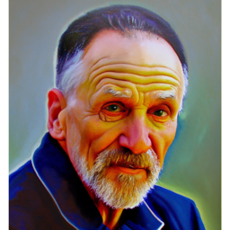
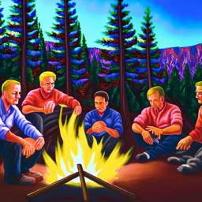

**Low vs. high `num_inference_steps`** (prompt `"a rocket ship"`):

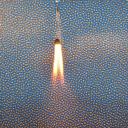

**Discussion.**
- *Stage 1 vs. Stage 2.* Stage 1 sets the overall composition and content at low resolution (64×64); it looks right but soft. Stage 2 is a conditional super-resolution diffusion model that adds high-frequency detail (edges, texture) to reach 256×256. The content stays the same, but the sharpness and fine structure improve a lot.
- *5 vs. 50 steps.* With only 5 denoising steps the sampler can't remove the noise accurately, so the image is blurry, low-contrast, and hard to read. At 50 steps each reverse step is a smaller, more accurate update, which gives a sharp, coherent image. Most of the improvement happens by about 20 steps and then levels off; the 50-step result is only a little better than a 20-step one despite costing much more.

---

## Part 1: Sampling-Loop Mechanics

### Task 1.1: The Forward Process

The forward process adds noise per the pretrained schedule: `x_t = √ᾱ_t · x_0 + √(1−ᾱ_t) · ε`, `ε ~ N(0, I)`. Test image noised at **t ∈ {250, 500, 750}**:

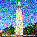
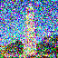
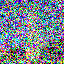

**Discussion.** As `t` grows, `√ᾱ_t` shrinks and `√(1−ᾱ_t)` grows, so the clean signal is progressively drowned out by Gaussian noise. At `t=250` the structure is still clearly visible; by `t=750` the image is almost pure noise.

### Task 1.2a: One-Step Denoising

Using the UNet's noise estimate to jump straight to a clean-image estimate: `x̂_0 = (x_t − √(1−ᾱ_t) · ε̂_θ(x_t, t)) / √ᾱ_t`. Null prompt `"a high quality photo"`, at **t ∈ {250, 500, 750}**:

| noisy | one-step estimate |
|---|---|
| 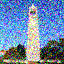 |  |
| 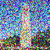 | 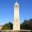 |
| 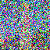 |  |

**Discussion.** The one-step estimate is good at low noise (`t=250`) but degrades badly as `t` rises: at `t=750` it is blurry and washed out, because the model must reconstruct the entire clean image from almost pure noise in a single shot.

### Task 1.2b: Iterative Denoising (strided schedule)

`strided_timesteps = list(range(990, -1, -30))` → **34 timesteps** (990, 960, …, 30, 0), following the DDPM reverse step
`x_{t'} = √ᾱ_{t'}·β_t/(1−ᾱ_t)·x̂_0 + √α_t·(1−ᾱ_{t'})/(1−ᾱ_t)·x_t + σ_t z`, with `α_t = ᾱ_t/ᾱ_{t'}`, `β_t = 1−α_t`. The iterative loop was run starting from a test image noised to `i_start = 10`.

### Task 1.2c: One-Step vs. Iterative (same noise level, `i_start = 10`)

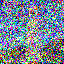

**Discussion: why iterative denoising beats one-step with the same model.** When the noise is large, lots of different clean images could have produced the same noisy `x_t`. The UNet only predicts one noise estimate, which works out to a kind of average over all of those images, so the one-step result comes out as a blurry mix of everything that could fit. Iterative denoising removes only a little noise at a time. After each small step the image is a bit cleaner, fewer clean images still fit it, and the model can settle on one specific image and start adding sharp detail. The network weights are exactly the same in both cases; the improvement just comes from taking many small, easy steps instead of one big jump.

### Task 1.3: Sampling With and Without CFG

Prompt `"a high quality photo"`; CFG uses `ε_cfg = ε_u + γ(ε_c − ε_u)` with **γ = 7**.

**Without CFG (5 samples):**

**With CFG, γ = 7 (5 samples):**

**Discussion.** The plain conditional samples are dull, low-contrast, and often incoherent. With CFG at γ=7 the samples are sharper, more saturated, and more clearly "photographic," because guidance extrapolates away from the unconditional prediction and amplifies the conditional signal. The trade-off is reduced diversity: the CFG samples look more alike than the un-guided ones.

---

## Part 2: Image Editing

### Task 2.1: SDEdit on the provided image and on your own image

Procedure: noise the input to the timestep for each `i_start ∈ {1, 3, 5, 7, 10, 20}`, then run `iterative_denoise_cfg` from that point with the null prompt `"a high quality photo"`.

**Provided test image (campanile):**

**Own image, web image** (source: a downloaded web image):

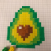

**Own image, hand-drawn:**

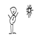

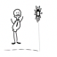

**Discussion: edit strength vs. `i_start`.** `i_start` sets how much noise we add before denoising again, i.e. how far back in the schedule we start. A small `i_start` (=1) adds very little noise, so the model barely changes the input; the edit stays close to the original but is weak. A large `i_start` (=20) wipes out most of the original signal, so the model has to invent large parts of the image, giving a stronger and more creative edit that drifts further from the input. So there is a smooth trade-off between staying faithful (low `i_start`) and being creative (high `i_start`). The effect is clearest on the hand-drawn input, which looks most like a real photo at the higher `i_start` values.

### Task 2.2: Inpainting

New content is generated only inside a binary mask (1 = regenerate); everything outside is forced back to the original image, re-noised to the current timestep, at every step.

**Provided test image (mask over a region):**

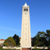

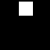

**Own image, own mask** (inpainting the web image with a custom rectangular mask):

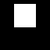

**Discussion.** The reverse process runs normally inside the mask, but at each step the region outside the mask is overwritten with the original image noised to match the current timestep. This keeps the surroundings fixed while letting the model generate new, context-consistent content inside the masked region. The boundary stays coherent because the model always sees the true (re-noised) surroundings while it denoises.

### Task 2.3: Text-Conditioned Image-to-Image Translation

Same as SDEdit but steered by a real prompt instead of the null prompt. **Prompt used: `"a rocket ship"`**, `i_start ∈ {1, 3, 5, 7, 10, 20}` on the provided test image.

**Discussion.** Compared with the null-prompt edit in Task 2.1, the text prompt injects *semantic* content, not just "realism." At low `i_start` the tall campanile silhouette is preserved but nudged toward rocket-like features; at high `i_start` the model is free enough to reshape the image into an actual rocket ship. The prompt controls which kind of real image the result is pulled toward, so the chosen words change what the edit becomes, not just how strong it is.

---

## Part 3: Diffusion Illusions

### Task 3.1: Visual Anagrams

Combined noise estimate `ε = ½·(ε_θ(x_t, t, p₁) + flip(ε_θ(flip(x_t), t, p₂)))`, γ = 7, denoised from pure noise (`i_start = 0`).

- `p₁` (upright) = `"an oil painting of an old man"`
- `p₂` (flipped) = `"an oil painting of people around a campfire"`

**Discussion.** Because the two noise estimates are averaged (one on the image, one on its vertical flip), the reverse process is simultaneously pulled toward both prompts under their respective orientations. The result reads as an old man right-side up and as people around a campfire when flipped.

### Task 3.2: Hybrid Images (Bonus)

Combined estimate `ε = f_low(ε_θ(x_t, t, p_low)) + f_high(ε_θ(x_t, t, p_high))`, where `f_low` is a Gaussian blur (`kernel_size=9`, `sigma=2.0`) and `f_high` is the estimate minus its own low-pass. γ = 7, `i_start = 0`.

- `p_low` (low frequencies / far) = `"a lithograph of waterfalls"`
- `p_high` (high frequencies / near) = `"a lithograph of a skull"`

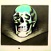

**Upsampled to 256×256** (optional stage-2 pass):

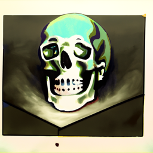

**Discussion: which prompt dominates far vs. near, and why.** The **waterfalls** prompt wins *from a distance*, because it provides the low spatial frequencies that set the overall shape and layout, and our eyes rely more on low frequencies when an image is small or blurry. The **skull** prompt wins *up close*, because it provides the high frequencies (fine texture and edges) that we only pick out at short range. Applying the low-pass/high-pass split to the *noise estimate* instead of to the pixels makes the model build this split directly into the generated image, so one picture reads as two different subjects depending on how far away you are. It works best when the two subjects have a similar rough outline, so the low-frequency prompt sets the shape and the high-frequency prompt just adds texture on top.

---

## Appendix: Prompts and Parameters Used

| Task | Prompt(s) | Key parameters |
|---|---|---|
| 0.1 | old man / campfire / rocket ship | stage 1 & 2 `num_inference_steps=20`; comparison 5 vs 50 (rocket) |
| 1.1 | n/a | t ∈ {250, 500, 750} |
| 1.2a | `"a high quality photo"` (null) | t ∈ {250, 500, 750} |
| 1.2b | `"a high quality photo"` | `strided_timesteps = range(990,-1,-30)` (34 steps), `i_start=10` |
| 1.2c | `"a high quality photo"` | `i_start=10` (one-step vs iterative) |
| 1.3 | `"a high quality photo"` | 5 samples no-CFG + 5 samples CFG, γ=7 |
| 2.1 | `"a high quality photo"` (null) | `i_start ∈ {1,3,5,7,10,20}`; campanile + web + hand-drawn |
| 2.2 | `"a high quality photo"` | provided mask (campanile) + custom mask on web image |
| 2.3 | `"a rocket ship"` | `i_start ∈ {1,3,5,7,10,20}` |
| 3.1 | `"an oil painting of an old man"` / `"an oil painting of people around a campfire"` | γ=7, `i_start=0` |
| 3.2 | `"a lithograph of waterfalls"` (low) / `"a lithograph of a skull"` (high) | Gaussian blur k=9, σ=2.0; γ=7, `i_start=0` |

**CFG guidance scale used throughout Parts 2–3:** γ = 7.
